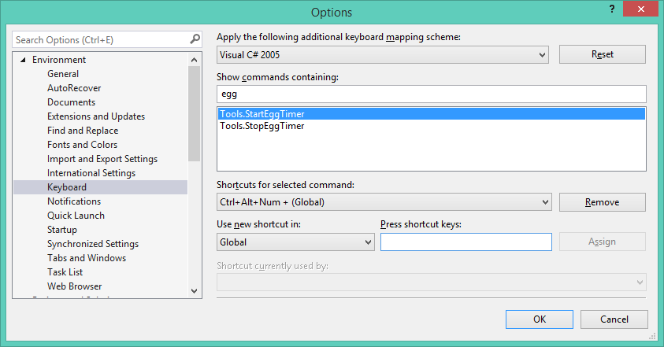
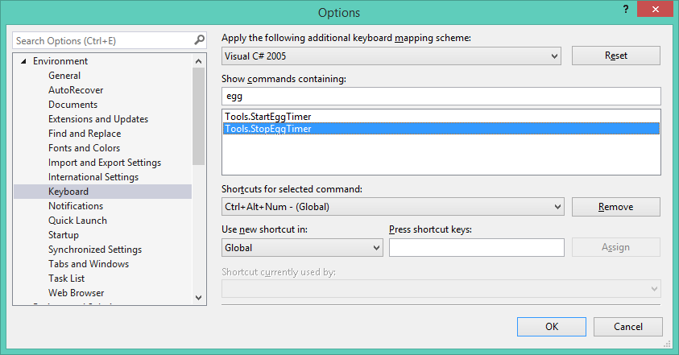

# Egg Timer

People have various ways to shut out the world when they need to concentrate. This extension is just another one of those ways. Instead of closing everything to stop notifications why not just stop notifications. The extension aims to help you quickly slip into a "leave me alone" mode and letting others know without taking you out the zone to do it manually.

## Download

This project is available from the [Visual Studio Gallery](https://visualstudiogallery.msdn.microsoft.com/b24df203-1b94-48d9-b4fa-85e2506a29c2).

## Software Requirements

To compile this code you will need to have the Office 2013 SDK installed and more specifically the Lync bits from it.

## Release Notes

### Version 1.0

Very basic functionality. You are basically just able to start and stop a egg timer (which at the moment isn't a time =P) but what this does is switch Lync to Do not disturb and then back to Free on stopping it.

**Starting Egg Timer**

Starting the timer switches your status to Do not Disturb and sets your personal message to say that you having some quiet time and when you started with the idea being that they will know how long you have been in 'quiet mode'.

**Stopping Egg Timer**

Stopping the timer switches your status back to Free and clears the personal message

#### Pro Tip

This extension works nicely if you attach keyboard shortcuts to it =). In my environment I have *Ctrl+Alt+Num +* assigned to Starting 

and *Ctrl+Alt+Num -* assigned to Stopping

**Enjoy!**